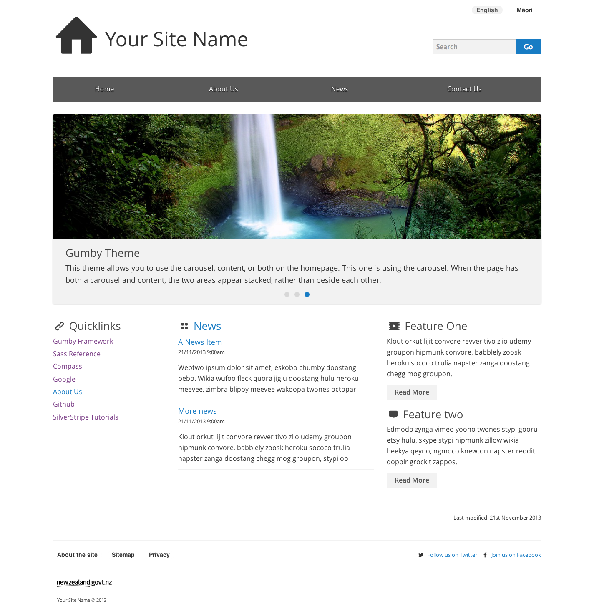

# Silverstripe Gumby Theme
_Migrated from https://gitlab.cwp.govt.nz/nguyer/cwp-gumby-theme_

This project started as a straight substitution of bootstrap for [gumby](http://gumbyframework.com/) within the CWP code base, but can be used as the starting point for any silverstripe theme. [CWP base templates](https://gitlab.cwp.govt.nz/cwp-themes/default) have been updated to work with the gumby scss framework, and extra styles added where needed. Accessibility has being taken into account, but otherwise the theme uses the gumby defaults with minor tweaking to fit with cwp templates.

**Compass and Sass compiling issues?**

> This branch has been updated to work with the latest Compass and Sass. If you are having issues with compiling, try the older version of this theme (2.6.3-oldcompass).

## Purpose
This theme is intended as a starting point for development, rather than a theme to be used out of the box. For this reason, it has not been styled to *look* like the CWP default theme, and design modifications have been kept to a minimum. Hopefully this should mean you spend less time taking out design features you don't want, and have more time to spend on adding your own themes.

## How to use
Either grab the git url, and clone into your themes directory or add it to your composer file [more info to come]
``` git clone https://github.com/adrexia/silverstripe-gumby.git ```

It is intended that development be done on the Sass files, rather than editing the CSS directly. Each component has been split out into it's own file where possible. 

If you have never used Gumby, Sass, or Compass before, this is a good place to start: 

* http://gumbyframework.com/docs/#!/ 

If you need more try:

* http://sass-lang.com/
* http://compass-style.org/

When you have the theme and have renamed it to suit your project, open _settings.scss (sass/var/_setting.scss) and edit the theme name variable to match. This will update all scss links to point to your theme. Remember to run compass watch in the theme folder to compile your scss.

At the moment all extra javascript and css required is included in the templates. If you are using  [CWP](https://gitlab.cwp.govt.nz/cwp/cwp/tree/master), you should override the CWP BasePage.php function that includes scripts and css to prevent it trying to include unwanted bootstrap files. You can also move the extra js/css into your new function if you want to use the power of combine_files (Note: you will need to do this for the js to prevent some timing bugs from occuring).

## Browser support
* Firefox, Chrome
* IE8 and above
* Android, iPhone, iPad

## Screenshot
_HomePage_ 


